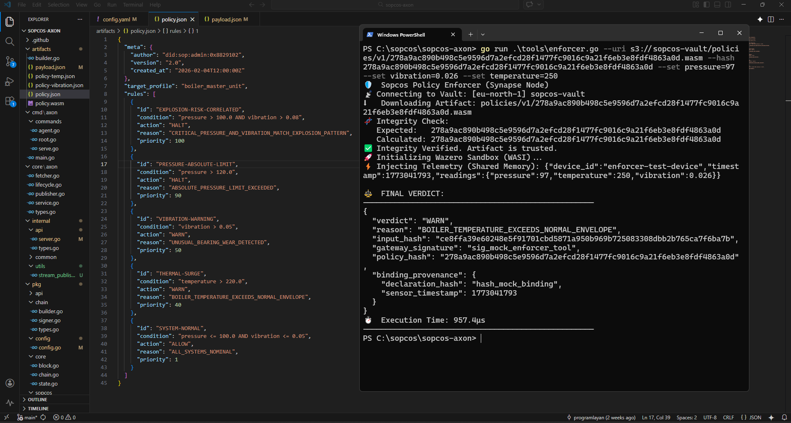

**Deterministic Industrial Policy Execution : SIP-019 Demonstration**
# SOPCOS SIP-019 - Grand Unification Test

This directory contains the demonstration artifacts, scripts and outputs used in the **SOPCOS SIP-019 Grand Unification test**.

The purpose of this test is to demonstrate **deterministic policy execution** using a WASM policy module together with a cryptographically anchored ruleset.

The demo shows how SOPCOS executes industrial policy logic while preserving **cryptographic traceability and reproducibility**.

---

## Demonstration Video

Full demonstration:

https://www.youtube.com/watch?v=V8Qj3fKOgQg

The video shows the complete protocol flow:

1. WASM policy module inspection  
2. Ruleset verification  
3. Artifact hash generation  
4. Artifact deployment  
5. Telemetry processing  
6. Deterministic verdict generation

---

## Terminal Execution Snapshot



The screenshot above illustrates the deterministic execution of a WASM policy module together with its associated ruleset.

In the SOPCOS protocol:

- policy logic is compiled into **WASM modules**
- rules are defined in **structured rule sets**
- both artifacts are **cryptographically hashed**

If any artifact changes, the resulting execution becomes invalid.

This property is fundamental for **industrial liability attribution** and **verifiable policy execution**.

---

## Test Overview

The SIP-019 Grand Unification test demonstrates the following key principles:

**Deterministic Execution**

The same inputs always produce the same verdict.

**Artifact Integrity**

Policy modules and rulesets are identified by cryptographic hashes.

**Protocol Traceability**

Every decision can be traced back to the exact artifact that produced it.

**Reproducibility**

Any third party can reproduce the same result using the provided artifacts.

---

## Test Flow

The test sequence executed in the video and scripts is as follows:

1. Inspect policy artifacts  
2. Verify ruleset structure  
3. Compute artifact hash  
4. Deploy artifact to runtime  
5. Submit telemetry input  
6. Execute WASM policy  
7. Produce deterministic verdict output

---

## Repository Structure

```
sip-019-grand-unification/
│
├─ scripts/
│ Test scripts used in the demonstration
│
├─ artifacts/
│ WASM policy module and ruleset files
│
├─ outputs/
│ Terminal outputs and example verdict results
│
├─ docs/
│ Supporting media (screenshots used in README)
│
└─ README.md
This document
```

---

## Artifacts Used

Example artifacts used in this test include:

- `boiler_master_unit.wasm`
- `boiler_master_unit.rules.json`

These artifacts represent a **policy unit** responsible for evaluating telemetry and producing a verdict.

---

## Reproducibility Notice

All artifacts in this repository are deterministic.

If any artifact hash changes, the protocol execution will fail or produce a different result.

This behavior is intentional and required to ensure **cryptographic accountability in industrial systems**.

---

## Related Standard

This test demonstrates concepts defined in:

**SOPCOS Improvement Proposal — SIP-019**

Policy Execution and Artifact-Anchored Runtime.

---

## SOPCOS Protocol

SOPCOS is an industrial trust protocol designed to provide:

- deterministic machine policy execution
- cryptographic traceability
- protocol-level liability attribution
- verifiable industrial automation

More information:

https://github.com/sopcos